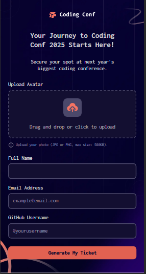
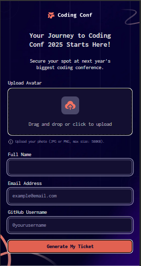
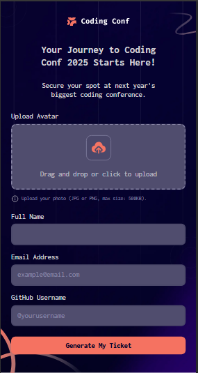
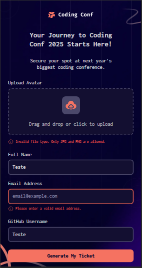
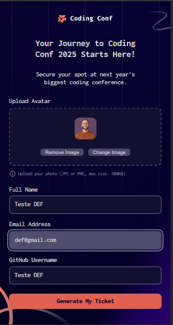
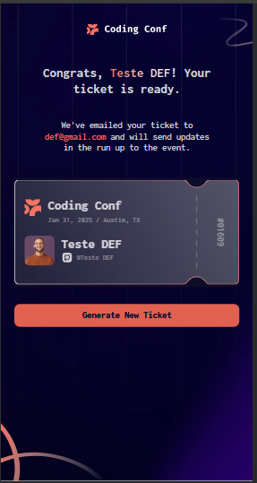
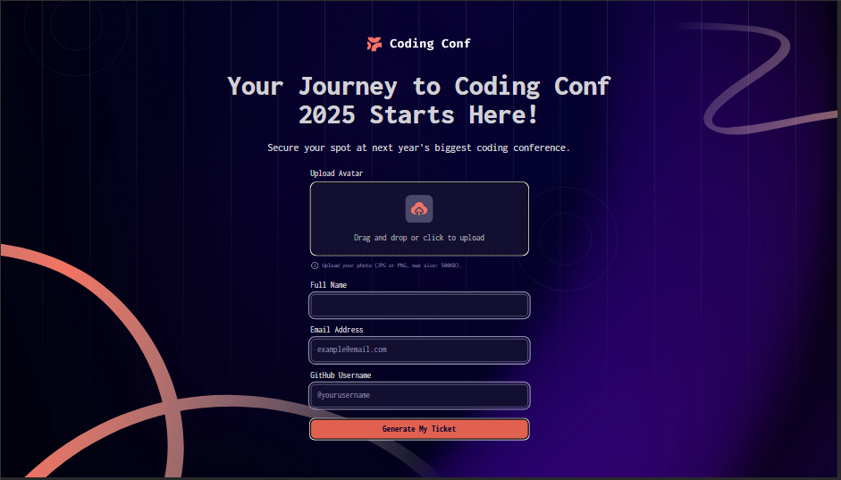
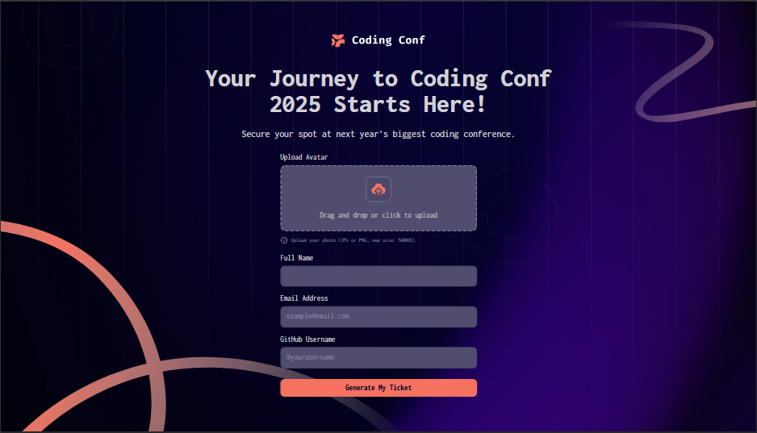
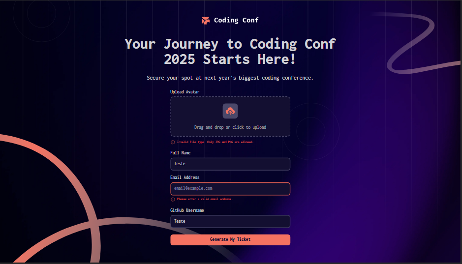

# conference-ticket-generator-main
conference-ticket-generator-main

This is a solution to the [conference-ticket-generator-main on Frontend Mentor](https://gillaercio.github.io/conference-ticket-generator-main/). Frontend Mentor challenges help you improve your coding skills by building realistic projects. 

## Table of contents

- [Overview](#overview)
  - [Screenshot](#screenshot)
  - [Links](#links)
- [My process](#my-process)
  - [Built with](#built-with)
  - [What I learned](#what-i-learned)
  - [Continued development](#continued-development)
- [Author](#author)

## Overview

### Screenshot

These are my screenshots showing how the project turned out.

- Mobile design:



- Mobile design with focus:



- Mobile design with hover:



- Mobile design with error:



- Mobile design form completed:



- Mobile design ticket completed:



- Desktop design:


- Desktop design with focus:



- Desktop design with hover:



- Desktop design with error:



- Desktop design form completed:


- Desktop design ticket completed:


### Links

- Solution URL: [My Solution](https://github.com/gillaercio/conference-ticket-generator-main)

## My process

### Built with

- Semantic HTML5 markup
- CSS custom properties
- Flexbox
- JavaScript
- Mobile-first workflow

### What I learned

I took advantage of this project to practice using **pseudo-element** and **clamp** with **CSS** and **regexp** and **drag and drop** with **JavaScript**:

Pseudo-element

```css
.input.filled::placeholder {
  color: transparent;
}
```

Clamp

```css
.title,
.congrats {
  font-size: clamp(3rem, 3.4rem + 1.666vw, 4.9rem);
}
```

RegExp

```js
if (email.value.trim() !== "") {
  const emailPattern = /^[^\s@]+@[^\s@]+\.[^\s@]+$/;
  hasError = !emailPattern.test(email.value.trim());
}
```

Drag and drop images

```js
uploadArea.addEventListener('dragover', (e) => {
  e.preventDefault();
    uploadArea.classList.add('focused', 'dragover');
});

uploadArea.addEventListener('dragleave', () => {
  uploadArea.classList.remove('focused', 'dragover');
});

uploadArea.addEventListener('drop', (e) => {
  e.preventDefault();
  uploadArea.classList.remove('focused', 'dragover');

  const droppedFile = e.dataTransfer.files[0];
  const fileInfoText = document.querySelector("#file-info span");
  const fileInfoImage = document.querySelector("#file-info img");

  const validTypes = ['image/jpeg', 'image/png'];
  if (!droppedFile || !validTypes.includes(droppedFile.type)) {
    showFileError("Invalid file type. Only JPG and PNG are allowed.");
    return;
  }
// ...
})
```

### Continued development

I would like to improve the use of the **HTML**, **CSS** and **JavaScript**.

## Author

- Frontend Mentor - [@gillaercio](https://www.frontendmentor.io/profile/gillaercio)
- Github - [My Github](https://github.com/gillaercio)
- LinkedIn - [My LinkedIn](https://www.linkedin.com/in/gildman-la%C3%A9rcio/)